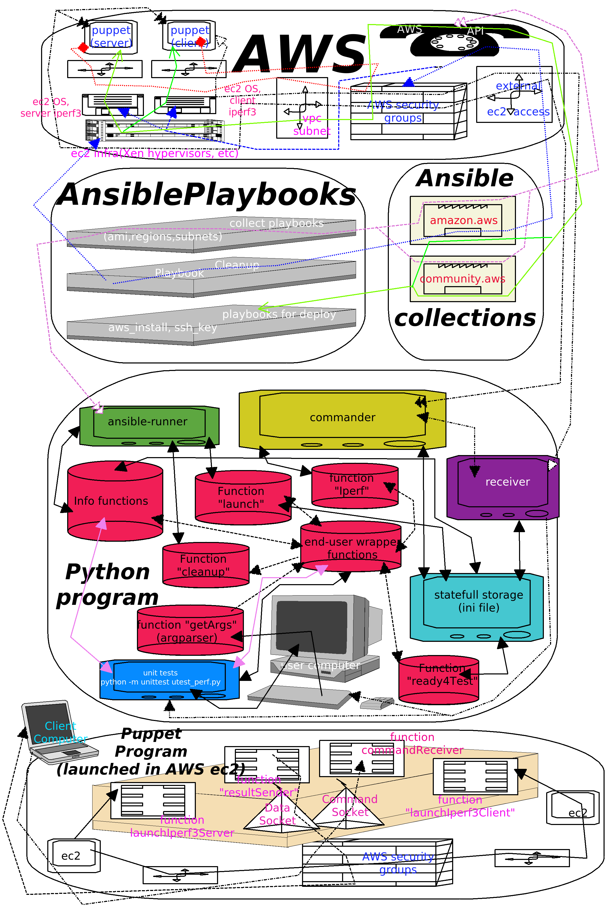

# AWS EC2 bandwidth tester concept program
## Overview
The program able to launch banch of performance tests inside one AWS AZ (vpc subnet).
In the frontend before the program, it has two options:

* Cli interface
* python "unittests"

In the backend, it uses:

* Ansible runner python module
* Ansible playbooks
* iperf3 python module
* iperf3 binary files
* ini file as statefull configuration storage

It can test performance of vpc subnet for different instance types and/or for different CPU amount for instances: program 
supports a feature to disable part of vCPUs for AWS instances  (if AWS API support this feature to selected type of instance)

## Installation
### Docker
The easest way to install program is use Docker
To do this, you need to git clone this repo, put your AWS credetials in the ini file, and launch a docker build. 
As fast as you'll get a docker image, you can launch a container with program:

```bash
docker build -t bandwidth_tester:0.2 .
docker run --name bandwidth_tester --rm -i -t bandwidth_tester:0.2 bash
```  

In the docker container console, you can use both program's interfaces (cli and unit tests)

### In the system
You need at least python3.6, pip3, and AWS boto. Installation:

```bash
#install python requirements including ansible
pip3 install -r requirements.txt
#install ansible collections
ansible-galaxy collection install amazon.aws -p ./
ansible-galaxy collection install community.aws -p ./
``` 
Next, please edit ini file. So, your program (probably) ready to launch. This program written in the Fedora/Pycharm
envinronment

##Using program
### cli interface
Program's cli interface has two automatic and several manuals modes:

```bash
usage: Tool to test bandwidth between AWS ec2 instances [-h] {info,launch,get,cputest,instancetest} ...

optional arguments:
  -h, --help            show this help message and exit

subcommands:
  list of commands

  {info,launch,get,cputest,instancetest}
                        description
    info                get info from AWS EC2
    launch              Launch ec2 instance in the selected region and with the selected subnet. Usage: bandwidth_tester launch -s <VPC subnet> -r <region>
    get                 get current status, clean up, run tests, etc
    cputest             run tests and do everything underhood - user can configure vcpu and instance type
    instancetest        run tests and do everything underhood - user can configure instance type

```
### cli program modes
So, the two main modes is "cputest" and the "instancetest". You can do same things using info functions,

### Launch everything manually 
In the manual (debug) operations the most useful key is key -v(verbose). If you're using it, it shows you the ansible output like this:
```bash
./bandwidth_tester.py info -r -v
{'command': 'info', 'verbose': True, 'list_regions': True, 'list_subnets': None, 'list_ami': None, 'image': None}
launch list_regions
[WARNING]: No inventory was parsed, only implicit localhost is available
[WARNING]: provided hosts list is empty, only localhost is available. Note that
the implicit localhost does not match 'all'

PLAY [localhost] ***************************************************************

TASK [Register regions] ********************************************************
ok: [localhost]

TASK [setting list of avaible regions] *****************************************
ok: [localhost]

PLAY RECAP *********************************************************************
localhost                  : ok=2    changed=0    unreachable=0    failed=0    skipped=0    rescued=0    ignored=0   

result=['eu-north-1', 'ap-south-1', 'eu-west-3', 'eu-west-2', 'eu-west-1', 'ap-northeast-2', 'ap-northeast-1', 'sa-east-1', 'ca-central-1', 'ap-southeast-1', 'ap-southeast-2', 'eu-central-1', 'us-east-1', 'us-east-2', 'us-west-1', 'us-west-2']

```
For example, to get avaible vpc subnets or Ubuntu 20.04 images, you can use commands:
```bash
./bandwidth_tester.py info -i us-east-2
launch function image(us-east-2)
result=ami-084ef34fdfdd7384c

./bandwidth_tester.py info -s us-east-2
launch function list_subnets(us-east-2)
result=['subnet-38750f43', 'subnet-0e9ea567', 'subnet-c236b78f']

```
Or to launch deployment by hands, specifying any settings manually:

```bash
./bandwidth_tester.py launch -r us-east-2 -t m5.large -T m5.large -c 1 -C 1 -s subnet-38750f43 -i ami-084ef34fdfdd7384c

```
Than, as fast as you get your system deployed, launch tests itself:
```bash
./bandwidth_tester.py get --iperf
send commands to puppets
INFO:root:commands to client and server has been done. Waiting...
I've just send commands to server and client
max speed is: 1015162372.068323 bytes/sec
or, in the human form,1.0 GB/sec
```
After it, you can do a manual cleanup:
```bash
./bandwidth_tester.py get --clean
launch function cleanup()
r.rc=0
I've just done a clean up job
result=True

```
To delete objects, which was described by program in the persistent storage for its statefull state - in the ini file

### test AWS ec2 instances (Automatic mode)
In this mode program launch actions, which was described above, automaticly. Also, if you launch program again with same
keys, it will not perform a cleanUP, and deployment again, and than launch tests, it launch them directly as fast as it
determine that it's a second launch with same params:

```bash
./bandwidth_tester.py instancetest -r us-east-2 -t t2.micro -T t3.micro 
determing if we need to reinstall
hmm... Looks like we already have installed instances! Checking it's settings...
looks like we already installed instances in the required mode(vCpu or general instances)
checking if types of instances is required
And instances types is also same! We just need to launch test again without any cleanups!
send commands to puppets
INFO:root:commands to client and server has been done. Waiting...
I've just send commands to server and client
max speed is: 90751230.73378968 bytes/sec

or, in the human form,90.8 MB/sec
result=90751230.73378968

```
Another possible case is if stored configuration is not suitable. Than, program launch a clean up, do new deployment in the AWS, and then tests itself:

```bash
./bandwidth_tester.py instancetest -r us-east-2 -t t2.micro -T t3.micro 
determing if we need to reinstall
looks like configuration is inconsitent, but we can't launch a cleanup. We need a new installation
so, we need new a installation
Determing the last Ubuntu 20.04 AMI image
Selecting random VPC in the us-east-2
I'm deploying two ec2 instances. It can take several minutes. If you want to observe a process, please use -v (verbose) key
send commands to puppets
INFO:root:commands to client and server has been done. Waiting...
I've just send commands to server and client
max speed is: 100788551.09746142 bytes/sec

or, in the human form,100.8 MB/sec
result=100788551.09746142


```
Here key -r represents an AWS region, -t - iperf3 client AWS instance type, and -T iperf3 server AWS instance type 

### Test AWS ec2 instances with selected amount of vCPU (automatic mode)
Like previous mode, it launched all underhood functions automaticly. And it can launch tests again, if configuration is same
This mode is supports set amount of vCPU for iperf server and clint, and type of instances as well. Example of usage:
```bash
./bandwidth_tester.py cputest -r us-east-2 -t m5.large -T m5.large -c 1 -C 1
determing if we need to reinstall
hmm... Looks like we already have installed instances! Checking it's settings...
send commands to puppets
INFO:root:commands to client and server has been done. Waiting...
I've just send commands to server and client
max speed is: 263137298.9593556 bytes/sec

or, in the human form,263.1 MB/sec
result=263137298.9593556
```
Here key -r represents an AWS region, -t - iperf3 client AWS instance type, and -T iperf3 server AWS instance type.
Also, -c represents amout of vCPUs for client, and -C for server. Please note: not each AWS instance type supports this
sort of settings! -v key can be helpful here - than ansible task to setting up instance fail, and you can see why it
happen

### tests via python module unittest

It's just proof of concept to attach them to CI/CD pipeline. By design, there are not unit tests.
Part of them are functional tests for program, and part integrational/performance tests
 
To launch unit tests from CLI, please use a command:

```bash
python3 -m unittest utest_perf.py
```

You can expect the output like:

```bash
root@58b9c9fbed5f:/bandwidth_tester# python3 -m unittest utest_perf.py
.....determing if we need to reinstall
hmm... Looks like we already have installed instances! Checking it's settings...
hmm... Looks like we already have installed instances! Checking it's settings...
instances types are same!
Regions is same!
looks like we already installed instances in the required mode(vCpu or general instances)
so, our previous configuration is good enough for us. Do nothing, just launch tests
send commands to puppets
INFO:root:commands to client and server has been done. Waiting...
I've just send commands to server and client
max speed is: 61994572.970098145 bytes/sec
<...>

mse=5.551115123125783e-16

.
----------------------------------------------------------------------
Ran 6 tests in 305.073s

PASSED (errors=0)
```
List of tests:
* test_regions (functional test), show list of regions)
* test_images (functional test), check using regex, if it returns suitable image for selected region)
* test_networks (functional test), check using regex, if it returns suitable subnet for selected region)
* test_instances (integrational/performance test), check if speed for default t2.micro instances will be good enough)
* test_instances (integrational/performance test), check if speed for default t2.micro instances will be good enough)
* test_cpu (integrational/performance test), check if speed for custom m5.large instances with 1 vCPU will be good enough)
* test_standard_deviation(end-to-end/performance test) - **the most interesting test**, probably can be useful in the real
cases, like check the standard deviation in the array of set of speeds results for the subnet/AZ

 
## Architecture
This is app's architecture scheme:
 
   
 


